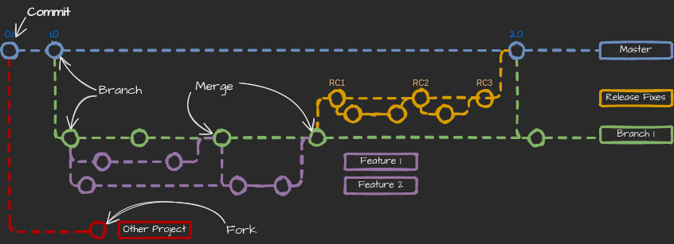
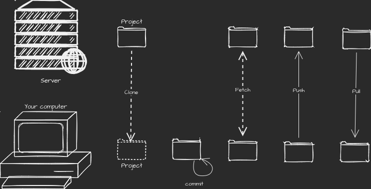
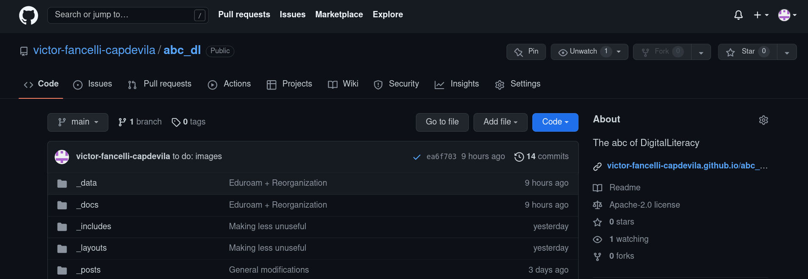
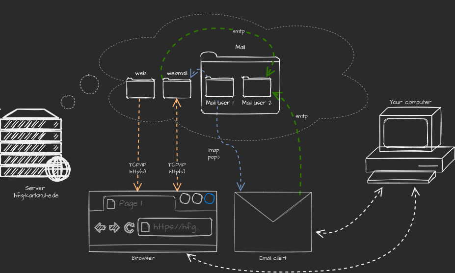
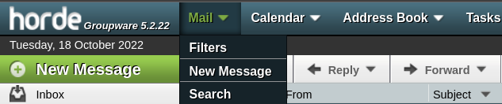

# Previously in _the abc of digital literacy_...

well...

1. You know how to markdown
2. your eduroam is configured
3. That's how user-documentation works

Now we have some user documentation… _would it be nice to publish it so that anyone can read it?_

---

# Git, Email: Encryption & Filters

---

# Git and GitHub

Version control vs real time collaboration

> it provides pipelines to develop the website, make a web from our md; have an issue reporter

The drawback: it's Microsoft, but we can export and use it in other platforms

---

# Git: how does git work?





---

# Git actions (simplified):




---

## Git also has an Issue Reporter



Be nice / Be clear / Be concrete

---

### Mail: how does it work?



---

# Mail Clients (my recommendation)


---

# Mail configuration

|                       | Incoming Server              | Outgoing server              |
|-----------------------|:----------------------------:|:----------------------------:|
| Protocol              | IMAP                         | SMTP                         |
| Hostname              | imap.hfg-karlsruhe.de        | smtp.hfg-karlsruhe.de        |
| Port                  | 143                          | 587                          |
| Connection Security   | STARTTLS                     | STARTTLS                     |
| Authentication method | Normal password              | Normal password              |
| Username              | email WITHOUT @hfg-karlsruhe | email WITHOUT @hfg-karlsruhe |

---

# You can also set a signature in Account Settings

```
///////
Staatliche Hochschule für Gestaltung Karlsruhe
Karlsruhe University of Arts and Design

Name
Role
Department

Lorenzstraße 15, 76135 Karlsruhe
working telephone number
yourmail@hfg-karlsruhe.de
```

---

# End-to-End Encryption


## OpenPGP

- Attach public key
- Store draft messages in encrypted format?

---

# General configuration

- Tags
- Reply /Reply to all
- Archive and account quota

---

# Address Book

Add LDAP Address Book:

| Name        |                            Postamt HfG |
|-------------|---------------------------------------:|
| Hostname    |                  ldap.hfg-karlsruhe.de |
| Base DEN    | ou=mailAccounts,dc=hfg-karlsruhe,dc=de |
| Port number |                                    389 |
| Bind DN:    |                                        |
| Use SSL     |                                     No |

Make a copy;  advanced:

| Don't return more than | 5000           |
|------------------------|:--------------:|
| Scope                  | One level      |
| Search filter          | (objectlass=*) |
| Login method           |                |

---

# Calendar & Tasks

Calendar + / On the Network /

| Username | username@hfg-karlsruhe.de |
| :---  | ---: |
| Location | https://cloud.hfg-karlsruhe.de/remote.php/dav/calendars/username@hfg-karlsruhe.de |


Put your password in prompt

---

# Managing Inbox, tips tricks

- Convert to date/task
- Save as template
- Tags
- Select column to display:
    - Starred messages
    - Message threads
- Reply to all? Forward? Between public and private

---

# Filters

Tools → Message Filters

but better in [webmail.hfg-karlsruhe.de](webmail.hfg-karlsruhe.de)




---

# Email-Lists in the HfG

Again [accounts.hfg-karlsruhe.de](accounts.hfg-karlsruhe.de)

---