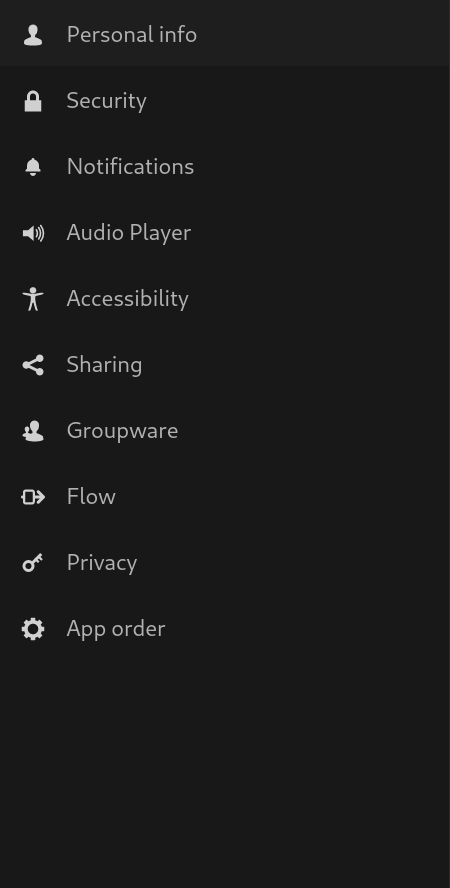
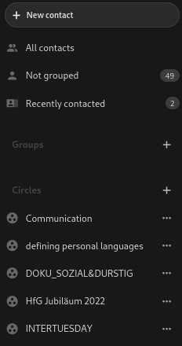
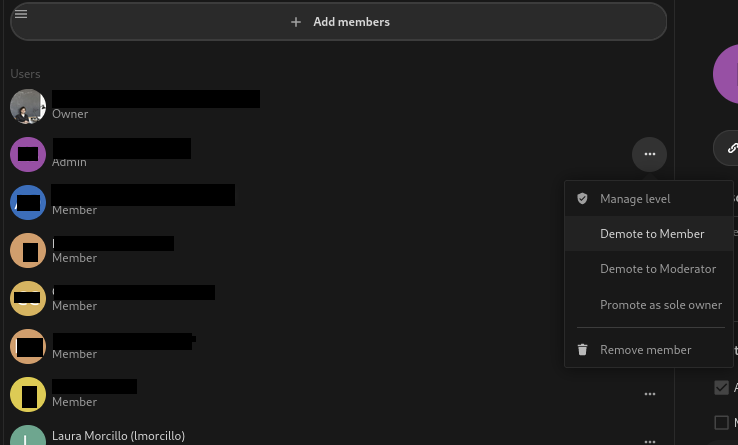
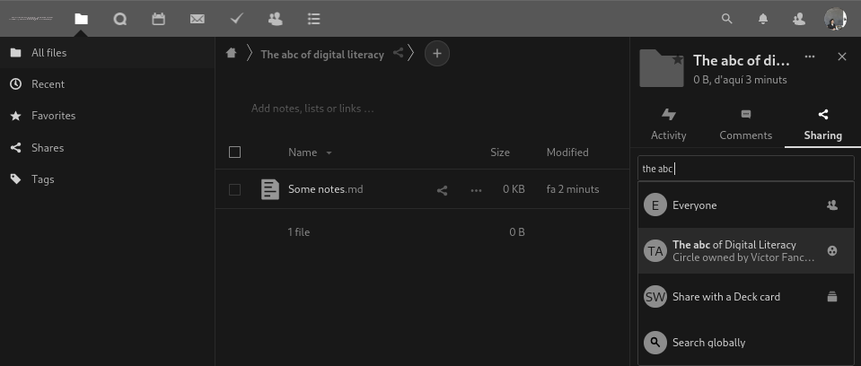
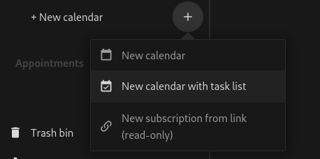

# Previously on _The abc of Digital Literacy_...

- [x] Markdown
- [ ] Eduroam → 
- [x] Mail
- [ ] Server-client relation
- [ ] git

---

<h1 class="r-fit-text">HfG-cloud (I):</h1>
<h2 class="r-fit-text">configuration client installation  groups, calendar, tasks</h2>

---

# HfG-Cloud (HfG Instance of Nextcloud)

> Nextcloud offers a modern, on-premises content collaboration platform with real-time document editing, video chat & groupware on mobile, desktop and web. 

From [Nextcloud.com](Nextcloud.com)

---

<h1 class="r-fit-text">Log-in in HfG-Cloud</h1>
<h2>[cloud.hfg-karlsruhe.de](cloud.hfg-karlsruhe.de)</h2>

Log-in: username@**hfg-karsruhe.de** 
password: Normal E-Mail password

---

## Configuration

---

### App Order

---

### Security - App password: 

---

<h1 class="r-fit-text">...would it not be great to have a client?</h1>

You can download the client at:  [https://github.com/nextcloud/desktop](https://github.com/nextcloud/desktop)

---

# Configuring the client

---

# Contacts

---

## Circle configuration

---

## Circle: Accounts management

---

# Sharing…

---

# ...is caring

---

# You can also share tasks and events

---

---

---

## And there is a webmail in the cloud....