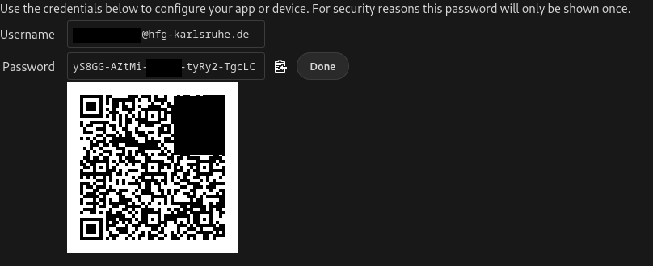
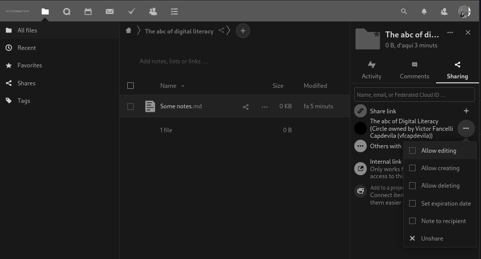

cloud.hfg-karlsruhe
[https://github.com/nextcloud/desktop](https://github.com/nextcloud/desktop)

# Previously on _The abc of Digital Literacy_...

- [x] Markdown
- [ ] Eduroam → 
- [x] Mail
- [ ] server-client relation
- [ ] git

---

# HfG-cloud (I):  configuration client installation  groups, calendar, tasks

---

# HfG-Cloud (HfG Instance of Nextcloud)

> Nextcloud offers a modern, on-premises content collaboration platform with real-time document editing, video chat & groupware on mobile, desktop and web. 
From [Nextcloud.com](Nextcloud.com)

---

## Log-in

Go to: [cloud.hfg-karlsruhe.de](cloud.hfg-karlsruhe.de) 
Log-in: username@**hfg-karsruhe.de** 
password: Normal E-Mail password

---

## Configuration

---

### App Order

---

### Security - App password: 

---

## ...would it not be great to have a client?

You can download the client at: [https://github.com/nextcloud/desktop](https://github.com/nextcloud/desktop)

---

# Development of Nextcloud

<iframe src="https://github.com/nextcloud/desktop" title="Nextcloud" width="100%" height="1000em"></iframe>

---

## Configuring the client

---

# Contacts

## Circle configuration

---
## Circle: Accounts management

Owner / Admin / Moderator / Member /Pending

---

# Sharing is caring…

---

# You can also share tasks and events

---

## And there is a webmail....